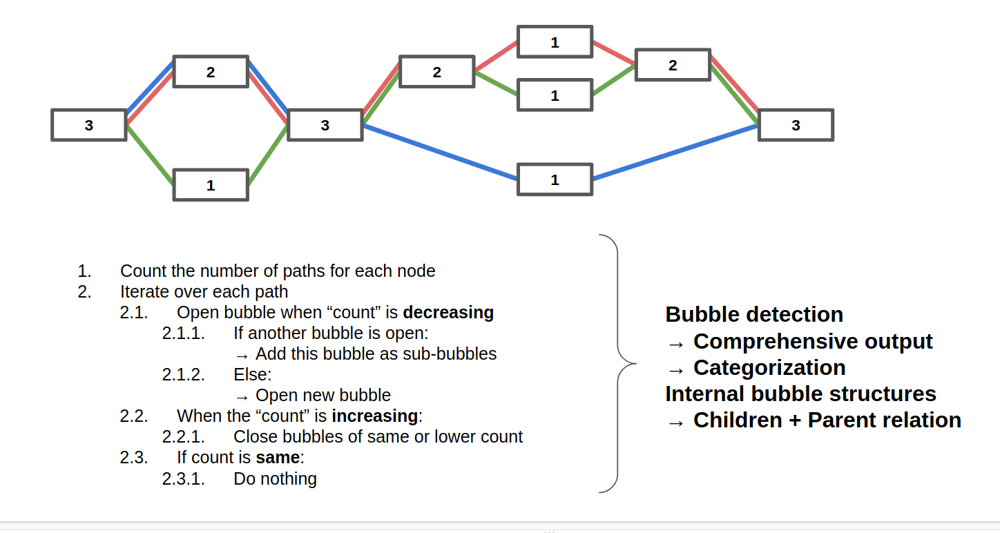

# pan-sv

Bubble detection using pan-level approach in variation graphs. Reporting variation based on pan-genomix information stored in paths. 


## Algorithm 


##Installation 

**From source** 
```text
git clone https://github.com/MoinSebi/pan-sv.git
cd pan-sv 
cargo build --release
```

## Running 
**Help message**
```text 
panSV 0.1.0

Sebastian V, Christian K

Bubble detection

USAGE:
    pan-sv --gfa <gfa>

FLAGS:
    -h, --help       Print help information
    -V, --version    Print version information

Input options:
    -d, --delimiter <delimiter>    Delimiter for between genome and chromosome
    -g, --gfa <gfa>                Input GFA file

Output options:
    -o, --output <output>    Output prefix [default: panSV.output]
        --nestedness         Adds NL-tag (nestedness-level) to the stats output file [default: off]

Threading:
    -t, --threads <threads>    Number of threads [default: 1]

Processing information:
    -q                  No updating INFO messages
    -v <verbose>        -v = DEBUG | -vv = TRACE
```
If delimiter is set, counting will be according to sample_name (see below) and not the path name.   
[PanSN-spec](https://github.com/pangenome/PanSN-spec): [sample_name][delim][haplotype_id][delim][contig_or_scaffold_name]


## Example: 
```bash
./pan-sv -g data/testGraph.gfa -o panSV.out
```

**TODO**
- [ ] More tests for validation
- [ ] Check if everything is working accordingly


### Output
1) bubbles statistic and
2) BED file for start and end position found in all sequences in the graph
[Documentation](doc.md)
